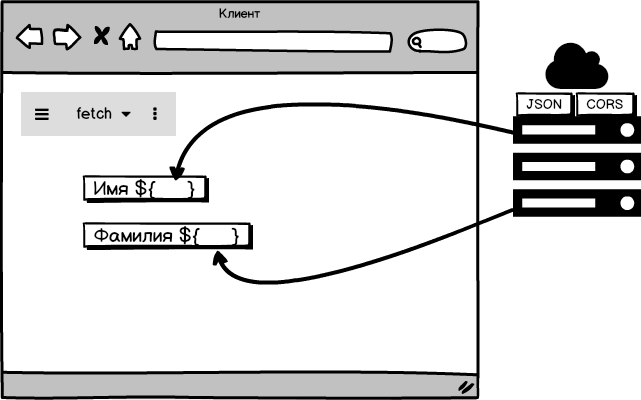

# Веб-теория

Задания.
---

1. Работая в своей папке, создайте сценарий, который по переданным ему двум числам a и b возвращает их сумму.

https://php-study1-gossoudarev.c9users.io/kurs/Ivanova/adder.php?a=5&b=3

Предусмотрите различные случаи значений параметров a и b.

Каким образом можно быстро проверить правильность работы такого сценария?

Убедившись, что сценарий правильно работает, сделайте пулл-реквест в этот репозиторий, который содержит файл  вида Ivanova1.txt где находится ссылка на сценарий и его текст.

2А. Напишите серверный сценарий https://php-study1-gossoudarev.c9users.io/kurs/Ivanova/firstname, который выдаёт с заголовком CORS документ  JSON {firstname: …, lastname: …} и убедитесь, что JSON отображается правильно при использовани инструментов типа JSON Formatter.

2Б. Напишите клиентский сценарий, который обращается к этому адресу и распределяет имя и фамилию по двум «полям» в документе, как показано на скетче:

