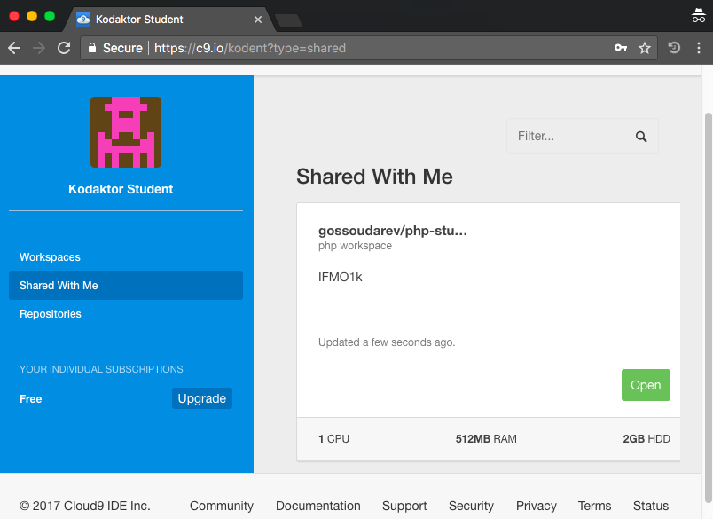
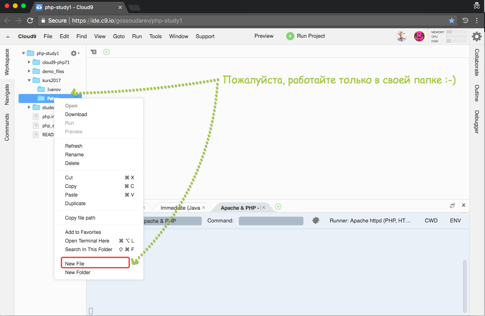
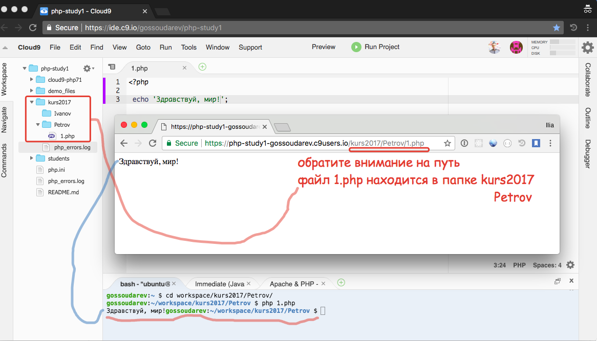

# PHP

Основной способ введения в PHP - среда cloud9

https://c9.io/kodent?type=shared

логин - kodent, пароль - стандартный.

Вам будет доступен проект, расшаренный из аккаунта gossoudarev

и просматриваемый в интернете как https://php-study1-gossoudarev.c9users.io

---

Вам также понадобится аккаунт на github.com и некоторые базовые умения, такие как создание пулл-реквеста.
